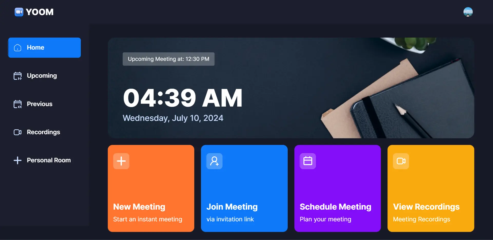

<div align="center">
    <a href="https://yoom-fv.vercel.app" target="_blank">
      
    </a>
  <h3 align="center">Zoom Clone</h3>
</div>

##  <br /> 📋 <a name="table">Table of Contents</a>

- ✨ [Introduction](#introduction)
- ⚙️ [Tech Stack](#tech-stack)
- 📝 [Features](#features)
- 🚀 [Quick Start](#quick-start)

##  <br /> <a name="introduction">✨ Introduction</a>

**[EN]** Built with the latest Next.js and TypeScript, this project replicates Zoom, a widely used video conferencing tool. It enables users to securely log in, create meetings and access various meeting functionalities such as recording, screen sharing, and managing participants.

**[FR]** Construit avec les dernières versions de Next.js et TypeScript, ce projet réplique Zoom, un outil populaire de visioconférence. Il permet aux utilisateurs de se connecter en toute sécurité, de créer des réunions et d'accéder à diverses fonctionnalités de réunion telles que l'enregistrement, le partage d'écran et la gestion des participants.

##  <br /> <a name="tech-stack">⚙️ Tech Stack</a>

- **React** is a popular JavaScript library for building user interfaces, particularly single-page applications where data changes over time. React's component-based architecture allows developers to create reusable UI components, making development more efficient and the codebase easier to maintain. Its virtual DOM enhances performance by minimizing direct interactions with the browser's DOM.

- **Next.js** is a React framework known for its server-side rendering (SSR) and static site generation (SSG) capabilities, enhancing performance and SEO for web applications. It offers features like automatic code splitting, API routes for server-side logic, and a plugin system for extensibility.

- **TypeScript** is a statically typed superset of JavaScript that allows for early detection of errors and more robust, maintainable code. TypeScript's type system helps developers catch mistakes early during the development process, ensuring a more stable and reliable application.

- **Clerk** is an advanced authentication and user management service that provides secure and seamless user login, registration, and profile management. Clerk handles complex authentication flows, including multi-factor authentication (MFA), social logins, and passwordless authentication, making it easy to manage user identities while maintaining high security standards.

- **GetStream** is a powerful API for building scalable and customizable activity feeds and chat applications. GetStream provides real-time updates, ensuring that users can see live changes and interactions. It supports features such as message threading, reactions, and typing indicators, enhancing the user experience in social and collaborative applications.

- **Tailwind** is a utility-first CSS framework that speeds up UI development by providing a set of pre-built utility classes. It allows developers to quickly build custom designs without writing traditional CSS, promoting rapid prototyping and design consistency.

- **shadcn/ui** is as comprehensive React component library designed for creating modern and responsive user interfaces. ShadCN offers a wide range of pre-built, customizable components that adhere to best practices for accessibility and performance. Its intuitive API and well-documented components enable developers to build consistent and aesthetically pleasing UIs with ease.

## <br/> <a name="features">📝 Features</a>

👉 **Authentication**: Implements authentication and authorization features using Clerk, allowing users to securely log in via social sign-on or traditional email and password methods, while ensuring appropriate access levels and permissions within the platform.

👉 **New Meeting**: Quickly start a new meeting, configuring camera and microphone settings before joining.

👉 **Meeting Controls**: Participants have full control over meeting aspects, including recording, emoji reactions, screen sharing, muting/unmuting, sound adjustments, grid layout, participant list view, and individual participant management (pinning, muting, unmuting, blocking, allowing video share).

👉 **Exit Meeting**: Participants can leave a meeting, or creators can end it for all attendees.

👉 **Schedule Future Meetings**: Input meeting details (date, time) to schedule future meetings, accessible on the 'Upcoming Meetings' page for sharing the link or immediate start.

👉 **Past Meetings List**: Access a list of previously held meetings, including details and metadata.

👉 **View Recorded Meetings**: Access recordings of past meetings for review or reference.

👉 **Personal Room**: Users have a personal room with a unique meeting link for instant meetings, shareable with others.

👉 **Join Meetings via Link**: Easily join meetings created by others by providing a link.

👉 **Secure Real-time Functionality**: All interactions within the platform are secure and occur in real-time, maintaining user privacy and data integrity.

👉 **Responsive Design**: Follows responsive design principles to ensure optimal user experience across devices, adapting seamlessly to different screen sizes and resolutions.


## <br /> <a name="quick-start">🚀 Quick Start</a>

Follow these steps to set up the project locally on your machine.

<br/>**Prerequisites**

Make sure you have the following installed on your machine:

- [Git](https://git-scm.com/)
- [Node.js](https://nodejs.org/en)
- [npm](https://www.npmjs.com/) (Node Package Manager)

<br/>**Cloning the Repository**

```bash
git clone {git remote URL}
```

<br/>**Installation**

Let's install the project dependencies, from your terminal, run:

```bash
npm install
# or
yarn install
```

<br/>**Set Up Environment Variables**

Create a new file named `.env` in the root of your project and add the following content:

```env
# Clerk
NEXT_PUBLIC_CLERK_PUBLISHABLE_KEY=
CLERK_SECRET_KEY=
NEXT_PUBLIC_CLERK_SIGN_IN_URL=/sign-in
NEXT_PUBLIC_CLERK_SIGN_UP_URL=/sign-up

# Stream
NEXT_PUBLIC_STREAM_API_KEY=
STREAM_SECRET_KEY=

# Next.js: Change this one with deployment URL!
NEXT_PUBLIC_SITE_URL=http://localhost:3000
```

Replace the placeholder values with your actual respective account credentials:

- [Clerk](https://dashboard.clerk.com)
- [GetStream](https://dashboard.getstream.io)


<br/>**Running the Project**

Installation will take a minute or two, but once that's done, you should be able to run the following command:

```bash
npm run dev
# or
yarn dev
```

Open [`http://localhost:3000`](http://localhost:3000) in your browser to view the project.
